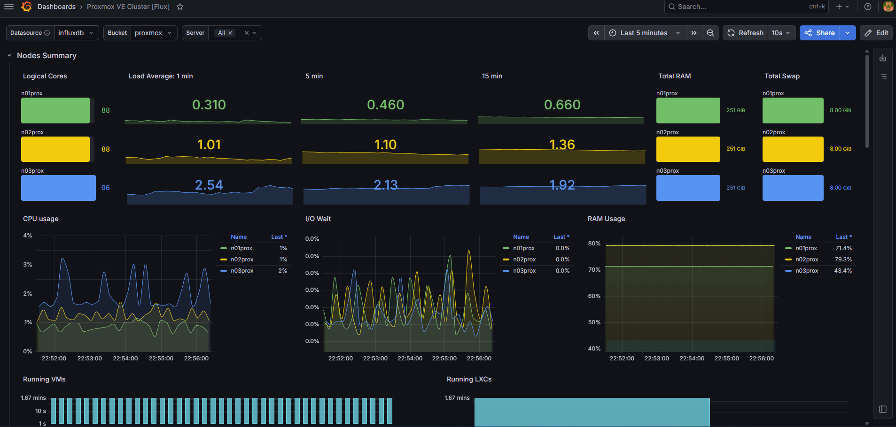
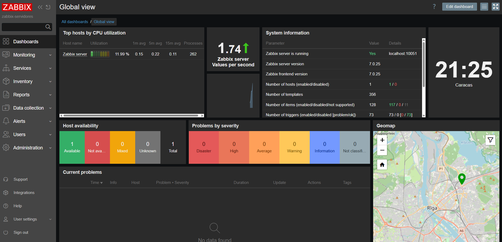
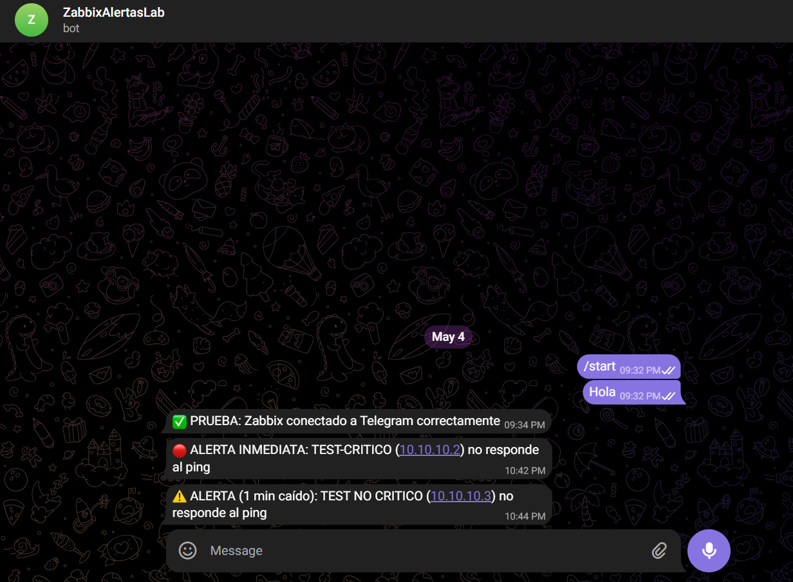

# Zabbix + Grafana + InfluxDB - Monitoreo Completo

Script automatizado para instalar Zabbix 7.0 LTS, Grafana e InfluxDB V2 en una sola máquina virtual con Debian 12.

---

## ⚠️ IMPORTANTE - ANTES DE EJECUTAR

**Debes editar el script principal y cambiar la siguiente contraseña por una segura:**

`DB_PASSWORD="CAMBIAR_A_CONTRASEÑA_SEGURA"`

Si no cambias esta contraseña, el script no se ejecutará.

---

## 📋 Descripción

**Problema que resuelve:**  
Las instalaciones tradicionales requieren 2 servidores separados (Zabbix en uno, Grafana en otro), duplicando recursos.

**Solución - Fase 1:**  
Este script instala y configura ambos servicios en una sola máquina virtual Debian 12.

**Solución - Fase 2 (Nuevo):**  
Se añade InfluxDB V2 para monitoreo NO invasivo de Proxmox a través de su Metrics Server nativo.

---

## 🚀 Tecnologías

| Tecnología | Versión | Puerto |
|------------|---------|--------|
| Zabbix Server | 7.0 LTS | 80 / 10051 |
| Grafana | Latest (OSS) | 3000 |
| InfluxDB V2 | 2.x | 8086 |
| MariaDB | 10.x | - |
| Debian | 12 (Bookworm) | - |

---

## ⚙️ INSTALACIÓN - FASE 1 (Zabbix + Grafana)

### 1. Crear el script

```bash
Crear Archivo:
nano install-zabbix-grafana.sh

Permisos:
chmod +x install-zabbix-grafana.sh

Ejecucion:
sudo ./install-zabbix-grafana.sh
```

### 2. Acceder a los servicios

| Servicio | URL | Usuario | Contraseña |
|----------|-----|---------|------------|
| Zabbix | http://TU-IP/zabbix | Admin | zabbix |
| Grafana | http://TU-IP:3000 | admin | admin |

---

## 🔧 Pasos después de ejecutar el script (Fase 1)

Una vez que el script termina correctamente, sigue estos pasos:

### 1. Cambiar contraseña de Zabbix

1. Abre: `http://TU-IP/zabbix`
2. Usuario: `Admin` | Contraseña: `zabbix`
3. Ve a **Administration → Users**
4. Haz clic en **Admin** → **Change password**
5. Asigna una contraseña segura
6. Guarda los cambios

### 2. Cambiar contraseña de Grafana

1. Abre: `http://TU-IP:3000`
2. Usuario: `admin` | Contraseña: `admin`
3. El sistema te pedirá cambiar la contraseña inmediatamente
4. Asigna una contraseña segura

### 3. Integrar Grafana con Zabbix

1. En Grafana, ve a **Configuration (rueda dentada) → Data sources → Add data source**
2. Busca **Zabbix** y selecciónalo
3. Configura:
   - **URL**: `http://localhost/zabbix/api_jsonrpc.php`
   - **Username**: `Admin`
   - **Password**: (la que asignaste en Zabbix)
4. Haz clic en **Save & Test**
5. Debe aparecer: `Zabbix API version: 6.0` ✅

### 4. Verificar servicios

```bash
systemctl status zabbix-server
systemctl status grafana-server
systemctl status mariadb
```

---

## 🤖 CONFIGURAR ALERTAS TELEGRAM (Fase 1)

### 1. Crear bot en Telegram

1. Abre Telegram y busca `@BotFather`
2. Envía: `/newbot`
3. Nombre: `ZabbixAlertas`
4. Username: `zabbix_alertas_bot` (debe terminar en `bot`)
5. **Guarda el token** (ejemplo: `1234567890:ABCdefGHIjklmNOPqrstUVwxyz`)

### 2. Obtener tu Chat ID

1. Envía un mensaje a tu bot: `Hola`
2. Abre en navegador: `https://api.telegram.org/botTU_TOKEN/getUpdates`
3. Busca `"id":` (ejemplo: `1254708547`)

### 3. Configurar script en el servidor

```bash
mkdir -p /usr/lib/zabbix/alertscripts

cat > /usr/lib/zabbix/alertscripts/telegram_bot.sh << 'EOF'
#!/bin/bash
TOKEN="TU_TOKEN_AQUI"
CHAT_ID="TU_CHAT_ID_AQUI"
MENSAJE="$1"

/usr/bin/curl -s -X POST "https://api.telegram.org/bot$TOKEN/sendMessage" \
    -d "chat_id=$CHAT_ID" \
    -d "text=$MENSAJE" \
    -d "parse_mode=HTML"
EOF

chmod 755 /usr/lib/zabbix/alertscripts/telegram_bot.sh
chown zabbix:zabbix /usr/lib/zabbix/alertscripts/telegram_bot.sh

/usr/lib/zabbix/alertscripts/telegram_bot.sh "✅ PRUEBA: Zabbix conectado a Telegram"
```

### 4. Configurar Zabbix Web

#### 4.1. Crear Media Type

**Alerts → Media types → Create media type**

| Campo | Valor |
|-------|-------|
| Name | `Telegram Bot` |
| Type | `Script` |
| Script name | `telegram_bot.sh` |
| Script parameters | `{ALERT.MESSAGE}` |

#### 4.2. Asignar medio al usuario Admin

**Administration → Users → Admin → Media → Add**

| Campo | Valor |
|-------|-------|
| Type | `Telegram Bot` |
| Send to | `telegram` |
| When active | `1-7,00:00-24:00` |

#### 4.3. Crear grupos de hosts

**Configuration → Host groups → Create host group**

- `Servidores Críticos`
- `Servidores No Críticos`

### 5. Configurar plantillas de monitoreo por ping

#### 5.1. Clonar plantilla ICMP Ping

**Configuration → Templates** → `Template ICMP Ping` → **Full clone**

| Clon | Template name |
|------|---------------|
| Crítico | `ICMP Ping - Critico` |
| No Crítico | `ICMP Ping - No Critico` |

#### 5.2. Configurar plantilla CRÍTICO (alerta inmediata)

**Items:** `ICMP ping` → **Update interval:** `5s`

**Triggers:** Editar `ICMP Ping: Unavailable by ICMP ping`

- **Expression:** `max(/ICMP Ping - Critico/icmpping,#1)=0`
- **Severity:** `High`
- Desactivar los otros dos triggers

#### 5.3. Configurar plantilla NO CRÍTICO (alerta en ~1 minuto)

**Items:** `ICMP ping` → **Update interval:** `1m` (no modificar)

**Triggers:** Editar `ICMP Ping: Unavailable by ICMP ping`

- **Expression:** `max(/ICMP Ping - No Critico/icmpping,#1)=0`
- **Severity:** `High`
- Desactivar los otros dos triggers

### 6. Crear acciones

#### Acción 1: Críticos

**Alerts → Actions → Create action**

- **Name:** `Alerta Telegram - Críticos`
- **Conditions:** `Host group` = `Servidores Críticos`
- **Operations:** Send to `Admin` via `Telegram Bot`
- **Custom message:** `🔴 ALERTA INMEDIATA: {HOST.NAME} ({HOST.IP}) no responde al ping`

#### Acción 2: No Críticos

**Alerts → Actions → Create action**

- **Name:** `Alerta Telegram - No Críticos`
- **Conditions:** `Host group` = `Servidores No Críticos`
- **Operations:** Send to `Admin` via `Telegram Bot`
- **Custom message:** `⚠️ ALERTA (1 min caído): {HOST.NAME} ({HOST.IP}) no responde al ping`

### 7. Probar con hosts de ejemplo

#### Host Crítico

**Configuration → Hosts → Create host**

| Campo | Valor |
|-------|-------|
| Name | `Test-Critico` |
| Groups | `Servidores Críticos` |
| IP | `10.255.255.254` |
| Templates | `ICMP Ping - Critico` |

**Tiempo estimado:** 1-5 segundos

#### Host No Crítico

**Configuration → Hosts → Create host**

| Campo | Valor |
|-------|-------|
| Name | `Test-NoCritico` |
| Groups | `Servidores No Críticos` |
| IP | `10.255.255.253` |
| Templates | `ICMP Ping - No Critico` |

**Tiempo estimado:** 40-60 segundos

### 8. Resultados esperados

| Tipo | Mensaje en Telegram | Tiempo |
|------|---------------------|--------|
| Crítico | 🔴 ALERTA INMEDIATA: Test-Critico (10.255.255.254) no responde al ping | 1-5 segundos |
| No Crítico | ⚠️ ALERTA (1 min caído): Test-NoCritico (10.255.255.253) no responde al ping | 40-60 segundos |

### 9. Resumen de configuración

| Plantilla | Item intervalo | Trigger | Severidad | Tiempo |
|-----------|---------------|---------|-----------|--------|
| **Crítico** | `5s` | `#1=0` | `High` | 1-5 segundos |
| **No Crítico** | `1m` | `#1=0` | `High` | 40-60 segundos |

---

## 📊 INSTALACIÓN - FASE 2 (InfluxDB + Métricas Proxmox)

### 1. Crear script de InfluxDB

```bash
nano instalar-influxdb.sh
```

> 📝 **El contenido del script está disponible en el repositorio o se puede solicitar al autor.**

### 2. Ejecutar el script

```bash
chmod +x instalar-influxdb.sh
./instalar-influxdb.sh
```

> ⚠️ **DURANTE LA INSTALACIÓN**  
> Aparecerá una pantalla azul preguntando por el archivo `influxdata.list`.  
> Debes seleccionar: **instalar la versión del responsable del paquete**  
> Usa flechas ↑ ↓ para moverte, TAB para ir a "Aceptar", ENTER para confirmar.

### 3. Configurar InfluxDB por primera vez

1. Abre navegador: `http://IP_DEL_SERVIDOR:8086`
2. Completa los siguientes valores:

| Campo | Valor |
|-------|-------|
| Username | `admin` |
| Contraseña | `admin123` |
| Initial Organization Name | `monitoreo` |
| Initial Bucket Name | `proxmox` |

3. **GUARDA EL TOKEN QUE APARECE AL FINAL** (es único e irrecuperable)

### 4. Conectar Grafana con InfluxDB

1. En Grafana: **Connections → Data sources → Add data source**
2. Busca **InfluxDB** y selecciónalo
3. Configurar:

| Campo | Valor |
|-------|-------|
| Query language | `Flux` |
| URL | `http://localhost:8086` |
| Organization | `monitoreo` |
| Token | (el token que guardaste) |
| Default bucket | `proxmox` |

4. Haz clic en **Save & Test**
5. Debe aparecer: `Data source is working` ✅

### 5. Configurar Proxmox para enviar datos a InfluxDB

> **Requisito:** Este paso NO instala nada en Proxmox. Usa el Metrics Server nativo.

1. Accede a Proxmox web: `https://IP_PROXMOX:8006`
2. Ve a **Datacenter → Metrics Server**
3. Haz clic en **Add → InfluxDB**
4. Configurar:

| Campo | Valor |
|-------|-------|
| Name | `influxdb-monitoreo` |
| Server | `IP_DEL_SERVIDOR_MONITOREO` |
| Port | `8086` |
| Protocol | `HTTP` |
| Organization | `monitoreo` |
| Bucket | `proxmox` |
| Token | (el mismo token que guardaste) |

5. Haz clic en **Create**
6. Verifica que el estado sea **Enabled: Yes**

### 6. Importar dashboard en Grafana

1. En Grafana: **Dashboards → New → Import**
2. Escribe el ID del dashboard: `19119` (recomendado para clusters)
3. Haz clic en **Load**
4. Selecciona tu data source **InfluxDB**
5. Haz clic en **Import**
6. En el dashboard, asegúrate que **Bucket = `proxmox`** (no `_monitoring`)

### 7. Dashboards probados y funcionales

| ID | Nombre | Estado |
|----|--------|--------|
| **19119** | Proxmox VE Cluster [Flux] | ✅ Funciona (recomendado) |
| **23309** | Proxmox 7/8 InfluxDB2 | ✅ Funciona |
| **16537** | Proxmox 7 [Flux] | ✅ Funciona |
| 10048 | Proxmox | ❌ No funciona (usa InfluxQL) |
| 22484 | Proxmox VM | ❌ No funciona (requiere Telegraf) |

---

## 🛠️ Comandos útiles para diagnóstico

```bash
# Ver log de Zabbix
tail -f /var/log/zabbix/zabbix_server.log

# Probar script manualmente
/usr/lib/zabbix/alertscripts/telegram_bot.sh "Prueba manual"

# Verificar conexión a base de datos
grep "^DBUser\|^DBPassword" /etc/zabbix/zabbix_server.conf
mysql -u zabbix -p'zabbixPassword123' -e "SELECT 1"

# Reiniciar Zabbix
systemctl restart zabbix-server

# Verificar InfluxDB
systemctl status influxdb
curl http://localhost:8086/health

# Verificar datos en InfluxDB
token=$(cat /root/influxdb_token.txt | cut -d'=' -f2)
curl -s -XPOST "http://localhost:8086/api/v2/query?org=monitoreo" \
    -H "Authorization: Token $token" \
    -H "Content-Type: application/vnd.flux" \
    -d 'from(bucket:"proxmox") |> range(start: -5m) |> limit(n:1)'
```

---

## 📁 Estructura del proyecto

```
proyecto-monitoreo/
├── install-zabbix-grafana.sh      # Script Fase 1
├── instalar-influxdb.sh           # Script Fase 2
└── README.md                      # Este archivo
```

---

## 📷 Capturas de pantalla

### Dashboard de Grafana con métricas de Proxmox



### Dashboard de Zabbix



### Alertas por Telegram



---

> **Nota:** Las capturas muestran el monitoreo funcionando en un entorno de prueba con 3 nodos Proxmox y alertas configuradas por niveles (crítico y no crítico).


## 📝 Autor

Carlos Silva  
GitHub: [@Carlos-Silva-Sys](https://github.com/Carlos-Silva-Sys)

